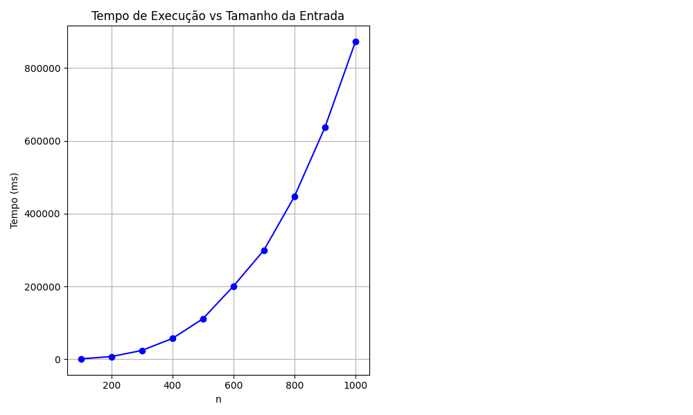

# JoaoLucas_ws_AA_RR_2025

Este projeto é um trabalho da disciplina de **Análise de Algoritmos**.

## Descrição

O objetivo do projeto é analisar o desempenho de um algoritmo (implementado em C no arquivo `fazalgo.c`) que possui complexidade cúbica O(n³). O projeto executa o algoritmo para diferentes tamanhos de entrada, mede o tempo de execução, armazena os resultados e gera relatórios e gráficos para análise da complexidade.

O fluxo do projeto é o seguinte:
1. O script PowerShell `run_tests.ps1` compila o código C, executa o algoritmo para diferentes valores de `n` e repetições, e salva os tempos médios em `resultados/resultados.csv`.
2. Após os testes, o script executa `analyze_results.py`, que processa os resultados, gera gráficos e um relatório textual em `relatorios/relatorio.txt`.

## Como executar

### Pré-requisitos

- Windows (necessário para o uso de PowerShell e da API de tempo do Windows)
- GCC (compilador C)
- Python 3.x
- Bibliotecas Python: `pandas`, `matplotlib`, `numpy`

Instale as dependências Python com:
```
pip install pandas matplotlib numpy
```

### Passos para execução

1. Abra o PowerShell na pasta do projeto.

2. Compile o código C antes de rodar os testes:
   ```
   gcc -O0 -o algoritmo.exe fazalgo.c
   ```
   Isso irá gerar o executável `algoritmo.exe` a partir do código-fonte `fazalgo.c`.

3. Execute o script de testes:
   ```
   .\run_tests.ps1
   ```
   O script irá rodar o executável para diferentes tamanhos de entrada, coletar os tempos de execução e gerar os arquivos de resultados e relatórios.

4. Os resultados estarão disponíveis em:
   - `resultados/resultados.csv`: tempos médios de execução para cada tamanho de entrada.
   - `relatorios/relatorio.txt`: relatório textual com análise da complexidade.
   - `relatorios/desempenho.png`: gráfico comparativo dos resultados.

## Estrutura dos arquivos

- `fazalgo.c`: implementação do algoritmo a ser analisado.
- `run_tests.ps1`: script para compilar, executar testes e coletar resultados.
- `analyze_results.py`: script Python para análise e geração de relatórios.
- `resultados/`: pasta com os resultados dos testes.
- `relatorios/`: pasta com relatórios e gráficos gerados.

## Exemplos de gráficos gerados

A execução do projeto gera gráficos que ilustram o desempenho do algoritmo. Exemplos:

**Tempo de Execução vs Tamanho da Entrada**


_O gráfico acima mostra a relação entre o tempo de execução e o tamanho da entrada, permitindo visualizar o crescimento cúbico esperado._

## Licença

Este projeto está licenciado sob a GNU GPL v3.
